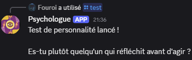
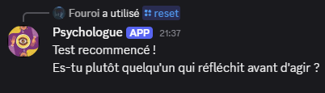
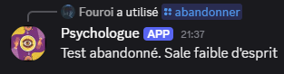
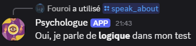
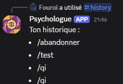
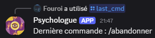
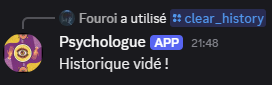
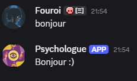

# 🤖 B2 Bot Discord - Projet d'Algorithmique


## 🎯 Objectifs du projet

1.  **Historique des commandes** :
2.  **Système de discussion** :
3.  **Sauvegarde persistante** : 
4.  **Fonctionnalités bonus** :
---

## 🎮 Fonctionnalités Détaillées

Le bot propose plusieurs fonctionnalités basées sur des structures de données algorithmiques :

### 🧠 1. Test de Personnalité (Arbre Binaire)

*   **/test** : Lance le parcours de l'arbre. Le bot pose une série de questions auxquelles l'utilisateur répond par "oui" ou "non".
    > 

*   **/reset** : Permet de recommencer le questionnaire depuis la racine de l'arbre si l'utilisateur change d'avis.
    > 

*   **/abandonner** : Arrête immédiatement le parcours en cours.
    > 

*   **/speak_about [sujet]** : Algorithme de recherche qui parcourt tout l'arbre pour vérifier si un sujet spécifique est abordé dans les questions ou les résultats.
    > 

### 📜 2. Historique Utilisateur (Liste Chaînée)

*   **/history** : Affiche la totalité des commandes envoyées par l'utilisateur depuis le début (parcours complet de la liste).
    > 

*   **/last_cmd** : Récupère uniquement la tête de la liste (la dernière action effectuée).
    > 

*   **/clear_history** : Supprime le nœud de tête et vide la liste chaînée de l'utilisateur.
    > 


### 💾 3. Sauvegarde Persistante (JSON)
*   **Sauvegarde Automatique** : À chaque nouvelle commande, la liste chaînée est convertie et sauvegardée dans un fichier `storage/data.json`.
*   **Chargement au Démarrage** : Lorsque le bot redémarre, il lit le fichier JSON et reconstruit les objets de la liste chaînée pour ne perdre aucune donnée.


### 🎲 4. Fonctionnalités bonus :
*   **/qi** : Un algorithme pour calculer votre QI.
    > 

*   **/help** : Affiche la liste de toutes les commandes disponibles.
    > 

*   **Interaction "bonjour"** : Le bot détecte le mot "bonjour" dans le chat et répond.
    > 


---

## 📂 Architecture du Projet


| Dossier / Fichier | Description | Structure de Données |
| :--- | :--- | :--- |
| `bot.py` | **Point d'entrée.** Gère la connexion Discord, les commandes slash et les événements. | - |
| `conversation/` | **Module de discussion.** Contient la logique du questionnaire. | - |
| ├── `arbre_binaire.py` | Implémentation manuelle de l'arbre de décision et gestionnaire de conversation. | **Arbre Binaire** |
| ├── `qi.py` | Logique du test de QI (fonctionnalité bonus). | - |
| `historique/` | **Module d'historique.** Gère le stockage temporaire des commandes utilisateurs. | - |
| ├── `list.py` | Implémentation manuelle de la liste chaînée (ajout, lecture, suppression). | **Liste Chaînée** |
| `storage/` | **Module de persistance.** Gère la sauvegarde et le chargement des données. | - |
| ├── `data_manager.py` | Sauvegarde les listes chaînées dans un fichier JSON et les reconstruit au démarrage. | JSON |
| `.env` | Fichier de configuration (contient le Token Discord). | - |

---

## ⚙️ Installation

Pour lancer le bot sur votre machine locale, suivez ces étapes :

### 1. Cloner le projet
```bash
git clone https://github.com/VOTRE_NOM/B2_bot_discord.git
cd B2_bot_discord
```

### 2. Créer un environnement virtuel
**Windows :**
```bash
python -m venv myenv
.\myenv\Scripts\activate
```
**Mac/Linux :**
```bash
python3 -m venv myenv
source myenv/bin/activate
```

### 3. Installer les dépendances
```bash
pip install discord.py python-dotenv
```

### 4. Configuration
Créez un fichier `.env` à la racine du projet